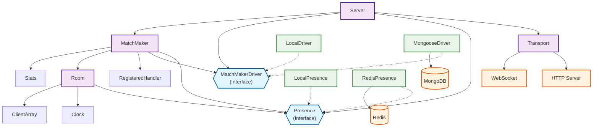
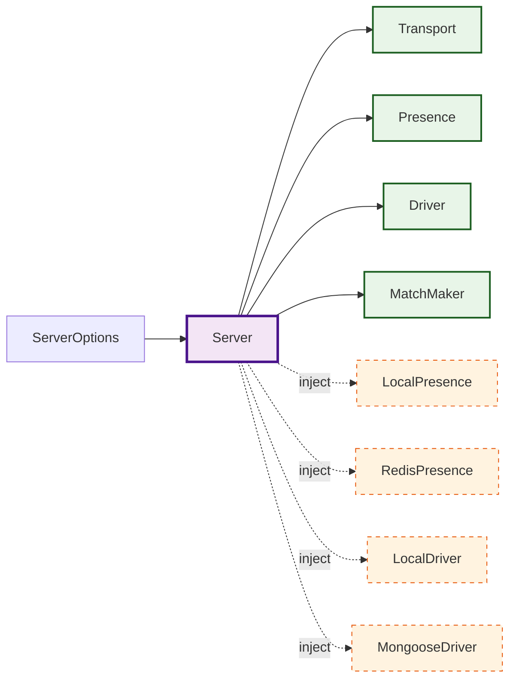
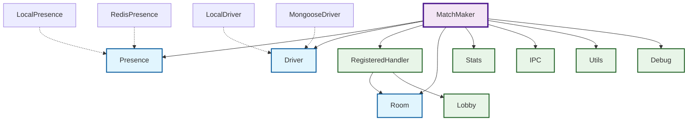
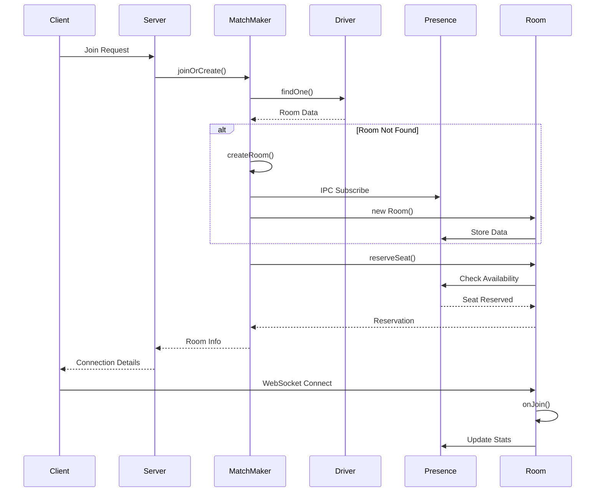
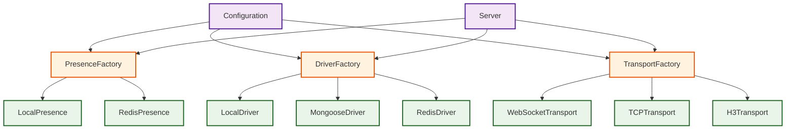
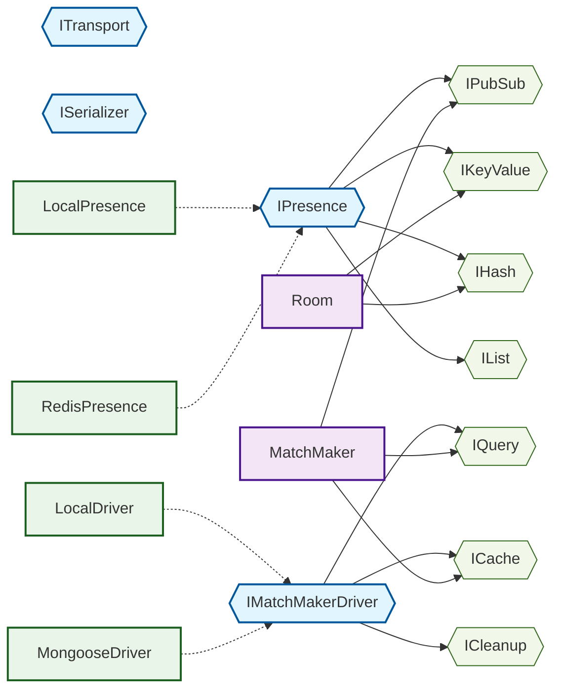
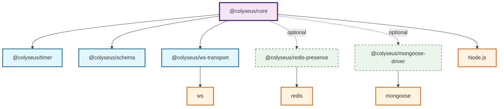

# Colyseus 클래스 의존성 다이어그램

## 📋 개요

이 문서는 Colyseus 프레임워크의 핵심 클래스들 간의 의존성 관계를 Mermaid 다이어그램으로 시각화합니다.

## 🏗️ 전체 아키텍처 의존성



## 🔗 Server 중심 의존성



## 🎯 MatchMaker 의존성 상세



## 🏠 Room 생명주기 의존성

```mermaid
graph TB
    Room[Room]

    %% 핵심 의존성
    Room --> Presence
    Room --> Clock
    Room --> ClientArray

    %% 직렬화
    Room --> Serializer
    Serializer --> SchemaSerializer
    Serializer --> NoneSerializer

    %% 클라이언트 관리
    ClientArray --> Client
    Client --> Transport

    %% 타이밍 시스템
    Clock --> Timer[@colyseus/timer]

    %% 상태 관리
    Room --> State[Game State]

    %% 이벤트 시스템
    Room --> EventEmitter

    %% 예외 처리
    Room --> RoomExceptions

    %% 스타일링
    classDef room fill:#f3e5f5,stroke:#4a148c,stroke-width:3px
    classDef core fill:#e1f5fe,stroke:#01579b,stroke-width:2px
    classDef client fill:#e8f5e8,stroke:#1b5e20,stroke-width:2px
    classDef external fill:#fff3e0,stroke:#e65100,stroke-width:2px

    class Room room
    class Presence,Clock,ClientArray,Serializer core
    class Client,Transport,EventEmitter client
    class Timer external
```

## 🔄 데이터 흐름 의존성



## 🏭 팩토리 패턴 의존성



## 🔧 인터페이스 분리 원칙



## 📦 모듈 의존성



## 🎯 주요 의존성 특징

### 1. **의존성 주입 (Dependency Injection)**
- Server가 모든 핵심 컴포넌트의 의존성을 관리
- 인터페이스 기반으로 구현체를 런타임에 주입
- 테스트와 확장성을 위한 유연한 구조

### 2. **인터페이스 분리 (Interface Segregation)**
- Presence와 Driver는 인터페이스로 추상화
- 클라이언트는 필요한 기능만 의존
- 구현체 교체가 용이한 구조

### 3. **단방향 의존성 (Unidirectional Dependencies)**
- 상위 레벨이 하위 레벨에 의존
- 순환 의존성 방지
- 명확한 계층 구조

### 4. **느슨한 결합 (Loose Coupling)**
- 인터페이스를 통한 간접 의존
- 구현체 변경이 클라이언트에 영향 없음
- 독립적인 테스트와 개발 가능

---
*이 다이어그램들은 Colyseus 0.16.x 버전을 기준으로 작성되었습니다.*