# Colyseus Room 생명주기: 생성과 파괴 과정

## 📋 개요

이 문서는 Colyseus Room의 전체 생명주기를 상세히 설명합니다. Room이 생성되어 클라이언트가 입장하고, 최종적으로 파괴되는 모든 과정을 단계별로 분석합니다.

## 🔄 Room 생명주기 전체 플로우

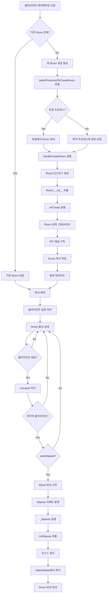

## 🚀 Room 생성 과정

### 1. 매치메이킹 요청 처리

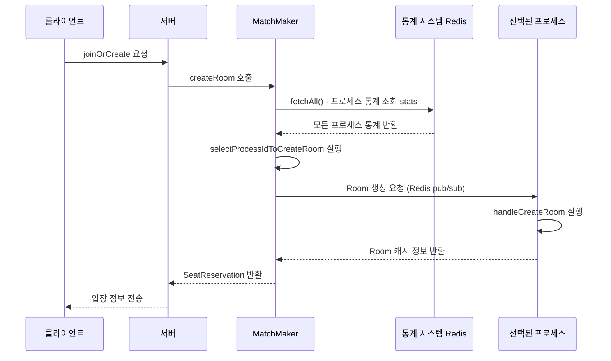

### 2. Room 인스턴스 생성

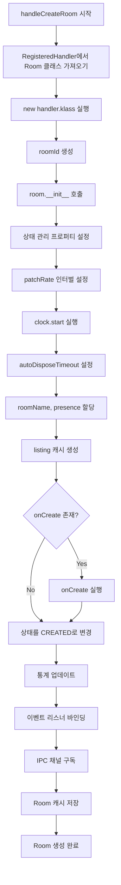

### 3. 이벤트 바인딩 및 초기화

```typescript
// MatchMaker.ts - handleCreateRoom()
room._events.on('lock', lockRoom.bind(this, room));
room._events.on('unlock', unlockRoom.bind(this, room));
room._events.on('join', onClientJoinRoom.bind(this, room));
room._events.on('leave', onClientLeaveRoom.bind(this, room));
room._events.on('visibility-change', onVisibilityChange.bind(this, room));
room._events.once('dispose', disposeRoom.bind(this, roomName, room));
```

## 👥 클라이언트 입장 과정

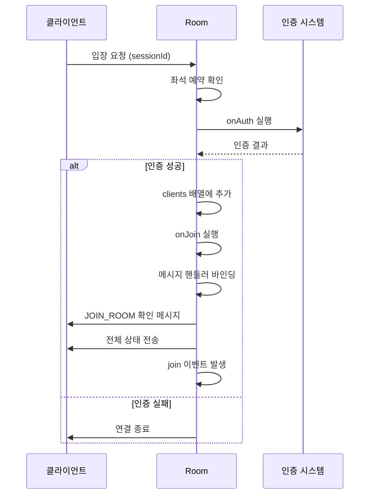

## 🔥 Room 파괴 과정

### 1. 파괴 트리거

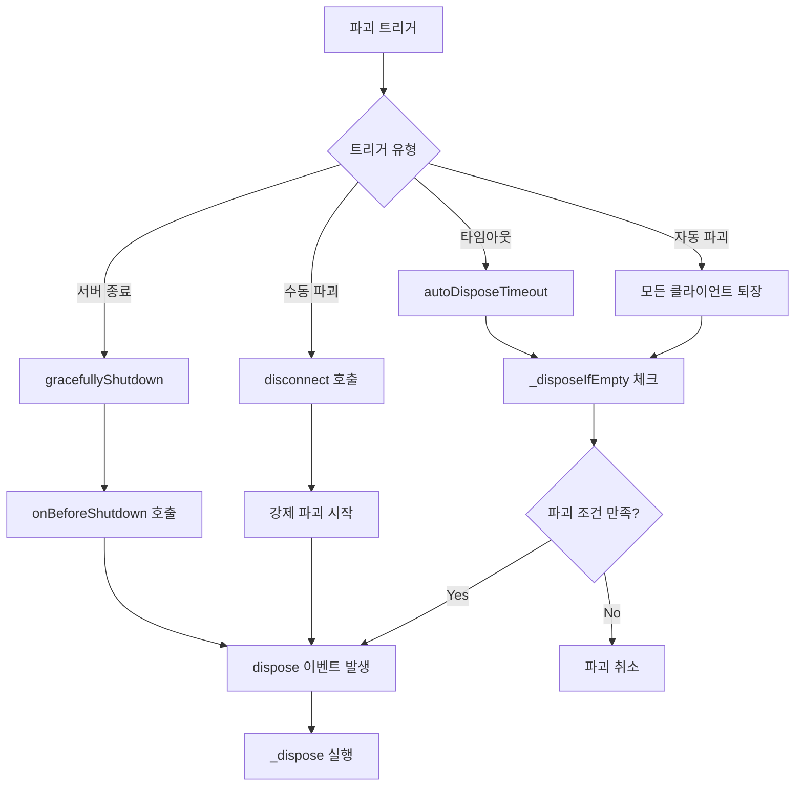

### 2. 클라이언트 정리 과정

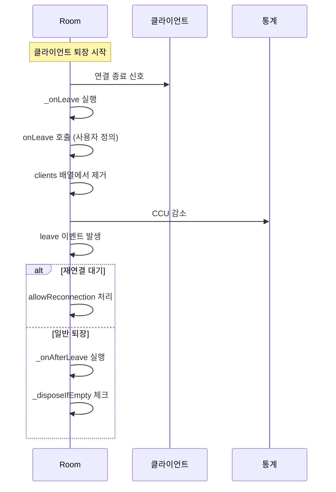

### 3. 리소스 정리 과정

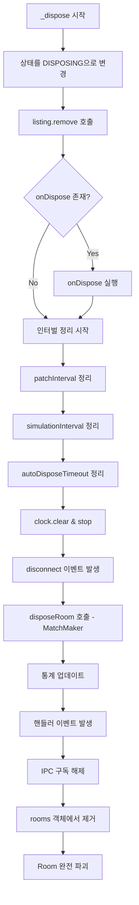

## 📊 상태 전이 다이어그램

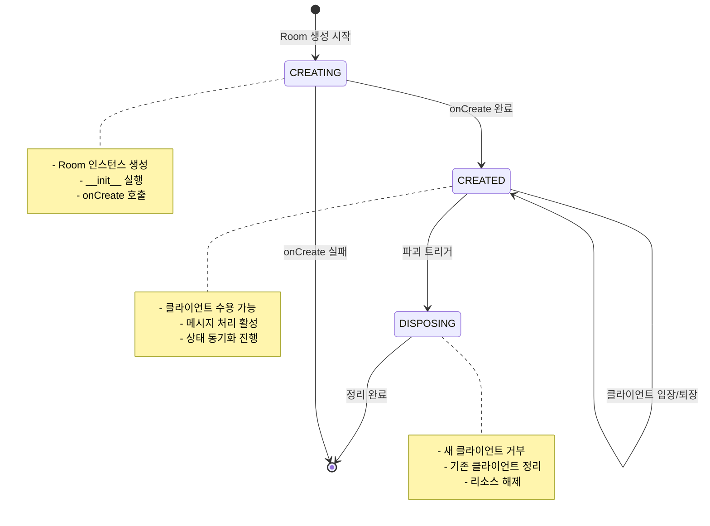

## 🔄 프로세스 간 통신 (IPC)

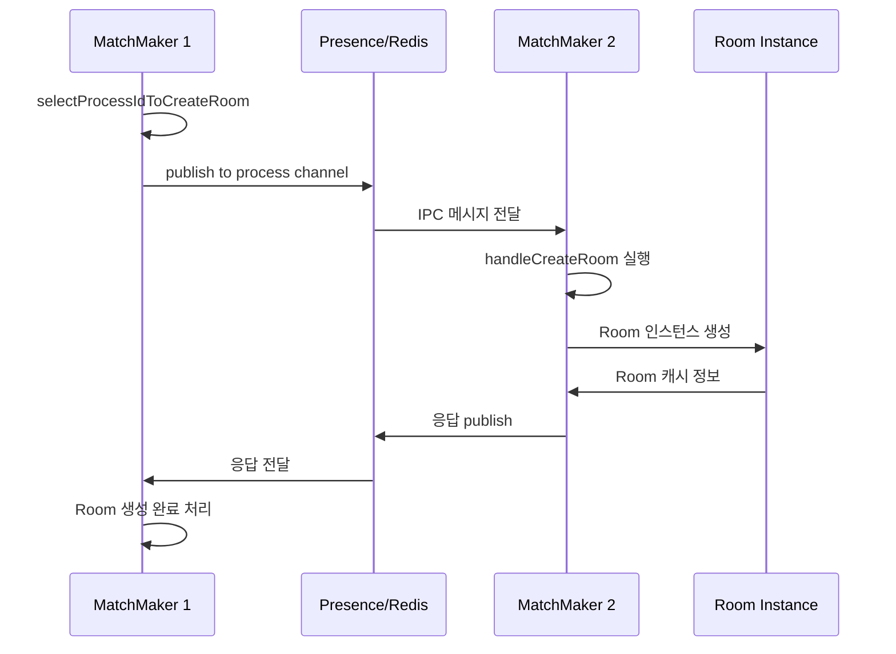

## 🎯 핵심 코드 흐름

### Room 생성
```typescript
// 1. 매치메이킹 요청
const room = await matchMaker.createRoom(roomName, clientOptions);

// 2. 프로세스 선택
const selectedProcessId = await selectProcessIdToCreateRoom(roomName, clientOptions);

// 3. Room 생성 (로컬 또는 원격)
if (selectedProcessId === processId) {
  room = await handleCreateRoom(roomName, clientOptions);
} else {
  room = await requestFromIPC(presence, getProcessChannel(selectedProcessId), undefined, [roomName, clientOptions]);
}

// 4. 좌석 예약
return await reserveSeatFor(room, clientOptions, authData);
```

### Room 파괴
```typescript
// 1. 파괴 조건 체크
protected _disposeIfEmpty() {
  const willDispose = (
    this.#_onLeaveConcurrent === 0 &&
    this.#_autoDispose &&
    this._autoDisposeTimeout === undefined &&
    this.clients.length === 0 &&
    Object.keys(this.reservedSeats).length === 0
  );

  if (willDispose) {
    this._events.emit('dispose');
  }
}

// 2. 리소스 정리
protected async _dispose() {
  this._internalState = RoomInternalState.DISPOSING;
  this.listing.remove();

  if (this.onDispose) {
    await this.onDispose();
  }

  // 모든 인터벌/타이머 정리
  this.clock.clear();
  this.clock.stop();
}
```

## 📈 성능 모니터링

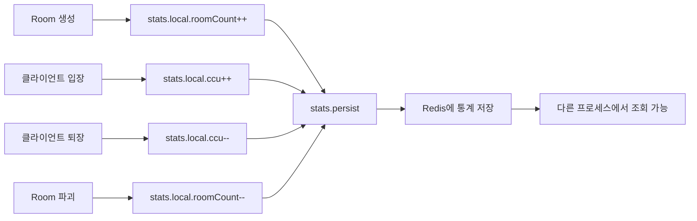

## 🛡️ 에러 처리 및 복구

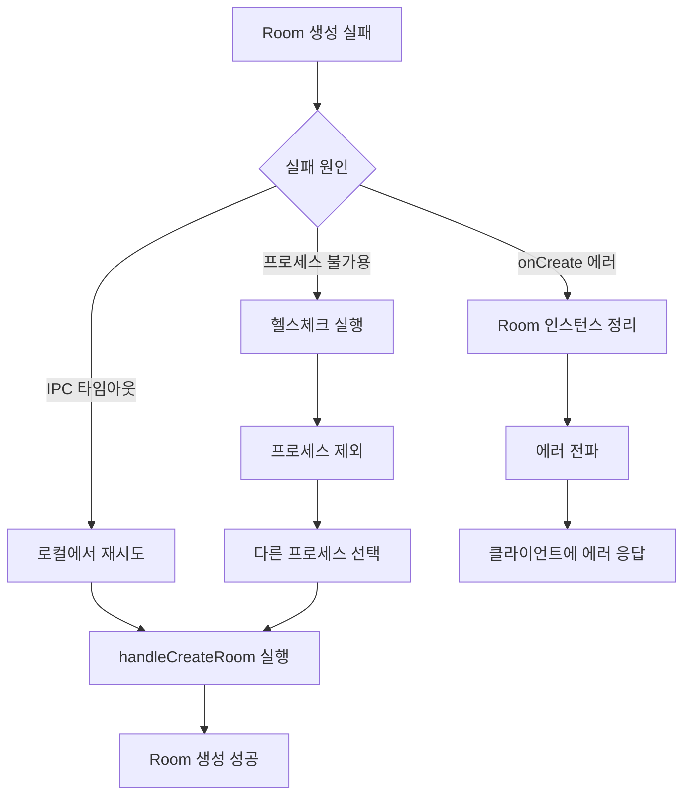

## 🎯 주요 특징

1. **비동기 처리**: 모든 생명주기 단계가 비동기로 처리
2. **분산 지원**: 여러 프로세스 간 Room 생성 분산
3. **자동 정리**: autoDispose를 통한 자동 리소스 관리
4. **상태 추적**: 실시간 통계 및 상태 모니터링
5. **에러 복구**: 프로세스 장애 시 자동 복구 메커니즘
6. **확장성**: 프로세스 추가/제거 시 자동 적응
7. **개발 편의성**: devMode에서 Room 상태 복원

---
*이 문서는 Colyseus Room의 전체 생명주기 분석을 바탕으로 작성되었습니다.*