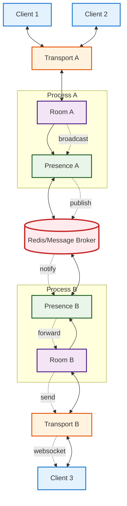
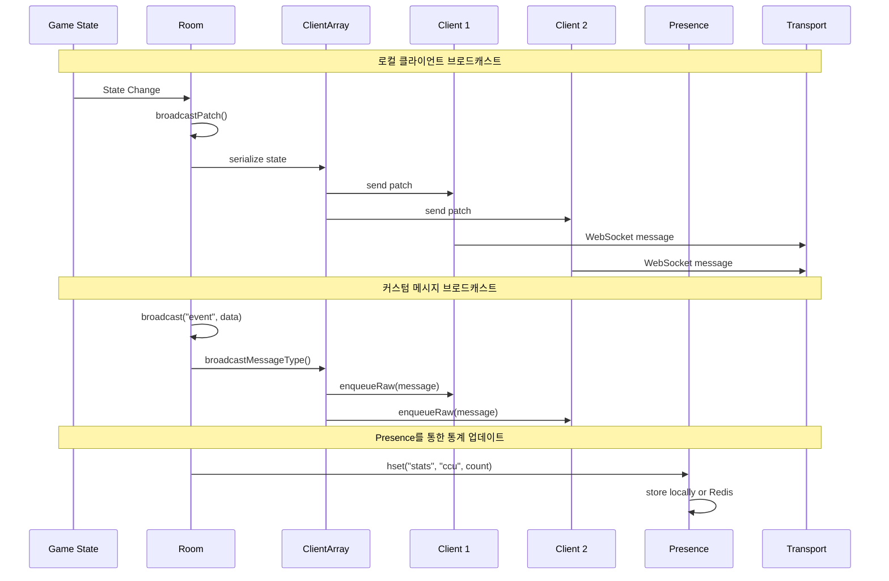
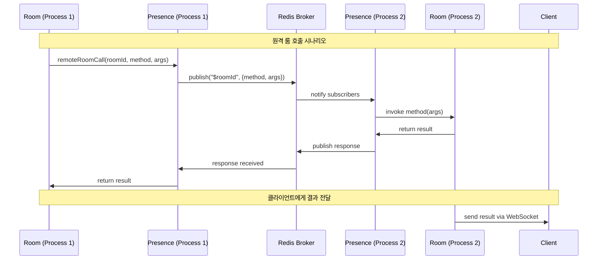
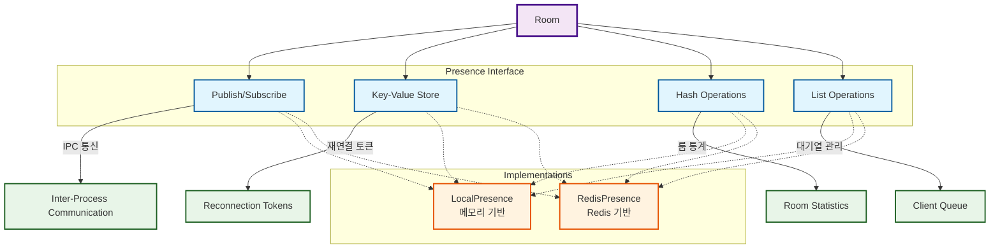
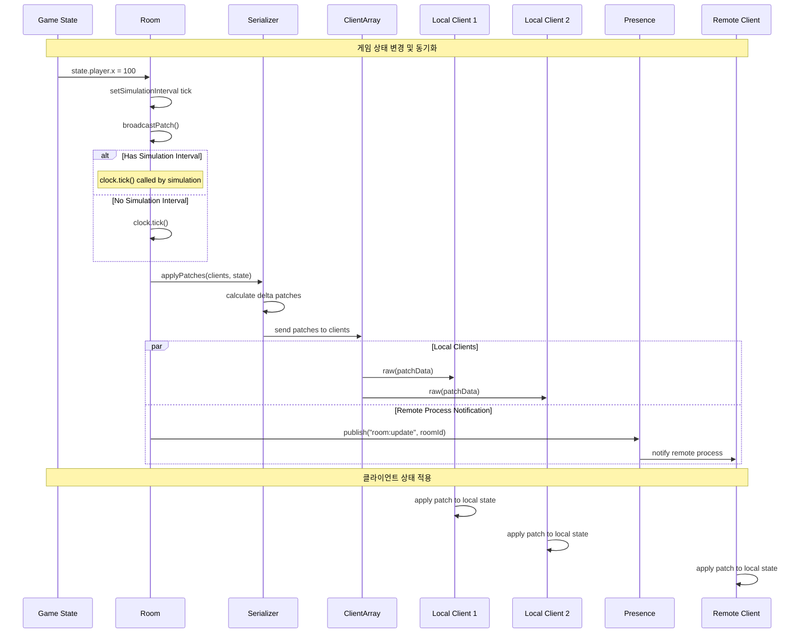
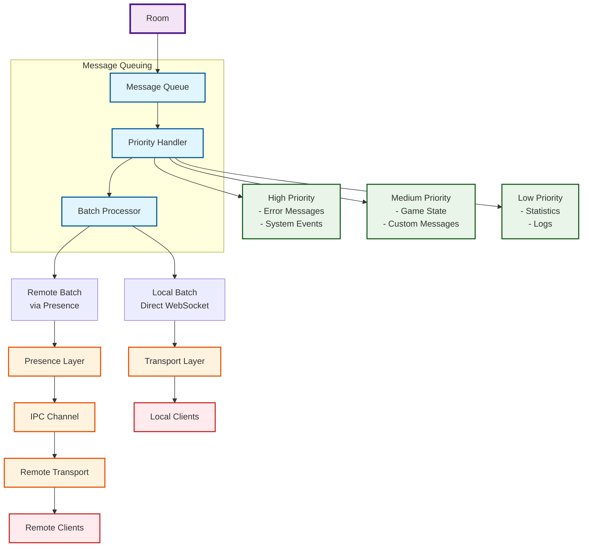
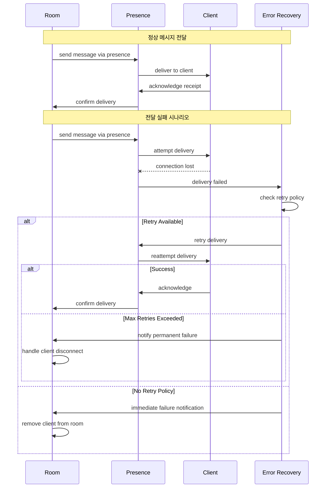
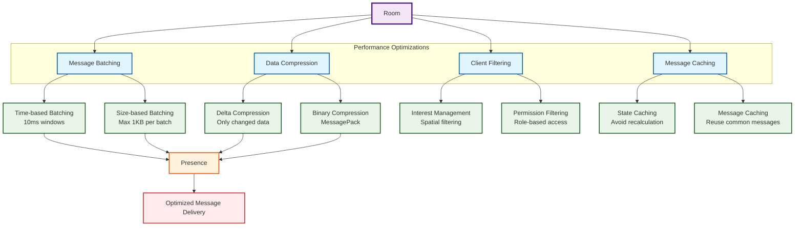
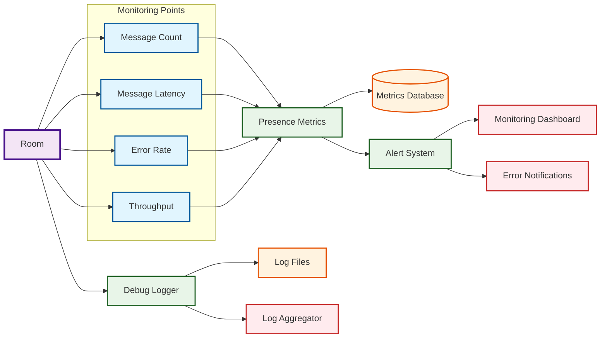

# Room 메시지 전달 시스템: Presence를 통한 클라이언트 통신

## 📋 개요

이 문서는 Colyseus Room이 Presence를 통해 클라이언트에게 메시지를 전달하는 과정을 상세히 분석하고 시각화합니다.

## 🔄 전체 메시지 흐름 아키텍처



## 📨 Room 내부 메시지 브로드캐스트 흐름



## 🌐 프로세스 간 메시지 전달 (IPC)



## 🔧 Presence 인터페이스 활용 패턴



## 📡 메시지 타입별 전달 경로

```mermaid
flowchart TD
    Room[Room Instance]

    %% 메시지 타입들
    StateSync[State Synchronization]
    CustomMsg[Custom Messages]
    SystemMsg[System Messages]
    ErrorMsg[Error Messages]

    Room --> StateSync
    Room --> CustomMsg
    Room --> SystemMsg
    Room --> ErrorMsg

    %% State Sync 경로
    StateSync --> Serializer[Serializer]
    Serializer --> Patch[Delta Patches]
    Patch --> LocalClients[Local Clients]

    %% Custom Message 경로
    CustomMsg --> Broadcast[broadcast()]
    Broadcast --> MessageType[Message Type Encoding]
    MessageType --> LocalClients

    %% System Message 경로 (IPC)
    SystemMsg --> Presence[Presence]
    Presence --> IPCChannel[IPC Channel]
    IPCChannel --> RemoteProcess[Remote Process]
    RemoteProcess --> RemoteClients[Remote Clients]

    %% Error Message 경로
    ErrorMsg --> ErrorHandler[Error Handler]
    ErrorHandler --> ClientError[Client Error Response]
    ClientError --> Transport[Transport Layer]

    %% Transport to Clients
    LocalClients --> Transport
    RemoteClients --> RemoteTransport[Remote Transport]
    Transport --> WebSocket1[WebSocket 1]
    Transport --> WebSocket2[WebSocket 2]
    RemoteTransport --> WebSocket3[WebSocket 3]

    %% 스타일링
    classDef room fill:#f3e5f5,stroke:#4a148c,stroke-width:3px
    classDef msgtype fill:#e1f5fe,stroke:#01579b,stroke-width:2px
    classDef process fill:#e8f5e8,stroke:#1b5e20,stroke-width:2px
    classDef transport fill:#fff3e0,stroke:#e65100,stroke-width:2px
    classDef client fill:#ffebee,stroke:#c62828,stroke-width:2px

    class Room room
    class StateSync,CustomMsg,SystemMsg,ErrorMsg msgtype
    class Serializer,Broadcast,Presence,ErrorHandler process
    class Transport,RemoteTransport,IPCChannel transport
    class WebSocket1,WebSocket2,WebSocket3,LocalClients,RemoteClients client
```

## 🔄 실시간 상태 동기화 시퀀스



## 🎯 메시지 큐잉 및 배치 처리



## 🛡️ 에러 처리 및 복구 메커니즘



## 📊 성능 최적화 패턴



## 🔍 디버깅 및 모니터링



## 🎯 핵심 메시지 전달 패턴 요약

### 1. **직접 전달 (Local Clients)**

```typescript
// Room 내 로컬 클라이언트들에게 직접 전달
room.broadcast("message", data);
// → ClientArray → Transport → WebSocket
```

### 2. **Presence를 통한 IPC (Remote Clients)**

```typescript
// 다른 프로세스의 클라이언트들에게 전달
await remoteRoomCall(roomId, "broadcast", ["message", data]);
// → Presence → IPC Channel → Remote Room → Remote Clients
```

### 3. **상태 동기화 (State Patches)**

```typescript
// 게임 상태 변경 시 자동 동기화
room.state.player.x = 100;
// → broadcastPatch() → Serializer → Delta Patches → All Clients
```

### 4. **통계 및 메타데이터 (Statistics)**

```typescript
// 룸 통계 정보 공유
room.presence.hset("room:stats", "ccu", clientCount);
// → Presence → Redis/Local Storage → Other Processes
```

## 🔧 구현 세부사항

### Presence 인터페이스 활용

- **publish/subscribe**: 프로세스 간 실시간 메시지 전달
- **key-value**: 재연결 토큰, 임시 데이터 저장
- **hash**: 룸 통계, 메타데이터 관리
- **list**: 클라이언트 대기열, 메시지 큐

### 메시지 최적화

- **배치 처리**: 여러 메시지를 묶어서 전송
- **압축**: Delta 압축으로 대역폭 절약
- **필터링**: 관심 영역 기반 선택적 전송
- **캐싱**: 반복 메시지 재사용

이러한 구조를 통해 Colyseus는 확장 가능하고 효율적인 실시간 메시지 전달 시스템을 제공합니다.

---
*이 문서는 Colyseus 0.16.x 버전을 기준으로 작성되었습니다.*